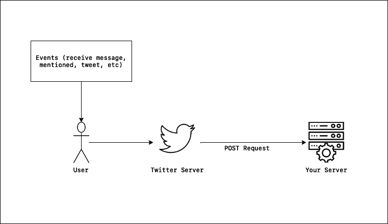
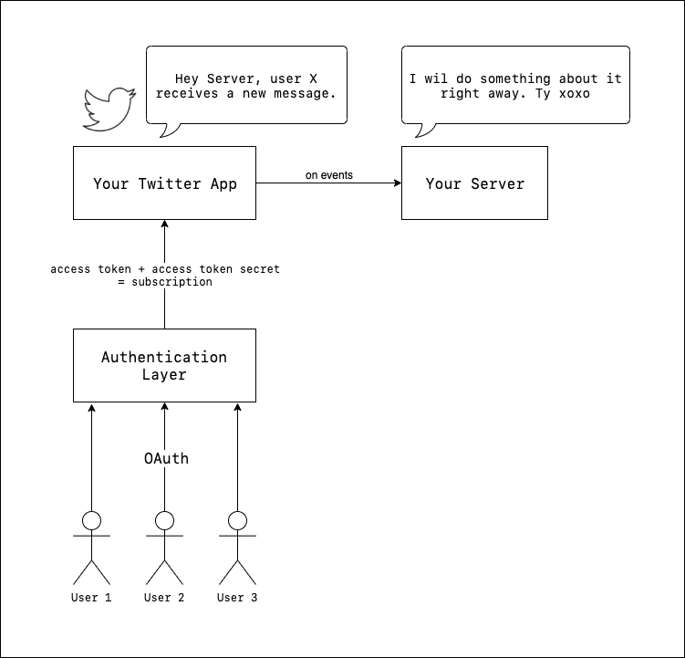
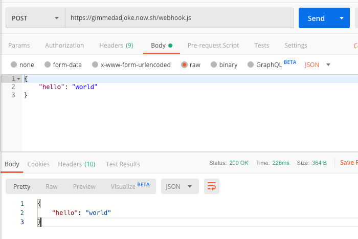
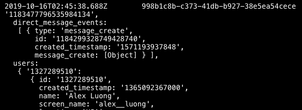
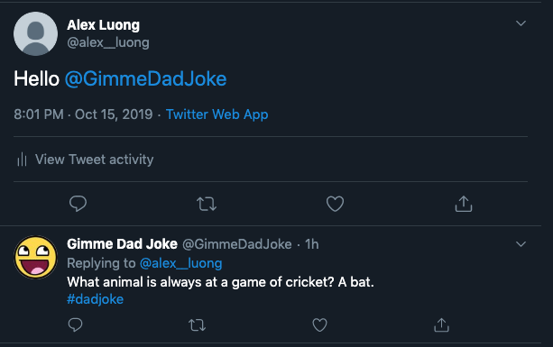

For the past 3 months, I've done a few development explorations with Twitter API. The results were (shameless plugs) my two projects, [Tweet Scheduler](https://thank-u-next.app) and [thank u, next](https://tynext.app). My experience has been less than stellar, to say the least. In my experience, the problem is that [Twitter Developer documentation](https://developer.twitter.com/en/docs) left a lot to desire. The biggest issue is [Account Activity API](https://developer.twitter.com/en/docs/accounts-and-users/subscribe-account-activity/overview), the new webhook concept that is quite challenging to understand and work with. In this post, I hope to explain how it works and build a fun Twitter bot to put these concepts in practice.

## Webhook and Subscription

Here is how Twitter webhook works.

 

When you use Twitter webhook to follow a user, you get notified whenever new events related to that user happen. Here is [the list of all events](https://developer.twitter.com/en/docs/accounts-and-users/subscribe-account-activity/overview) that you can subscribe to.

Simple enough, right?​


In many products, there is a nice and pretty UI where you can register the webhook URL. With Twitter you have to do everything programmatically. On top of that, Twitter also adds in the concept of subscription.

Let me elaborate with this diagram about Twitter subscriptions.



In many cases, in order to let a Twitter user to subscribe to your app, you need to handle OAuth to ask for permissions. Here are 2 use cases, one where you need to ask for permission and one where you don't.

### Use case 1

You're building a Twitter bot where it subscribes to  **its** own activities. For example, [@this_vid](https://twitter.com/this_vid), a Twitter bot that will download the video for users on mention, subscribes to the mention event.

In this case, when creating the Twitter app from that bot account, Twitter will give you an access token and secret that work for that account only. It is good enough for this use case, so you don't have to worry about OAuth. You will still need to use those token and secret to add a subscription to your webhook.

### Use case 2

You're building a Twitter bot where it subscribes to **others** activities. For example, in [thank u, next](https://tynext.app), the app subscribes to many different users direct messages events instead of its own Twitter account.

In this cases, you need to ask for permission to gain access to their activities. This involves Twitter authentication using OAuth 1. After a user signs in to your app, you will receive an access token and a secret token. Using those tokens, you can then add that user's subscription to your webhook.

### To sum up

- Register webhook to Twitter with an API call
- For each account whose activities you want to subscribe to, first ask for permission with OAuth to retrieve an access token and a secret token
- Then add a new subscription with another API call

## Practice

So, I'm gonna show you how Twitter webhook works by building [@GimmeDadJoke](https://twitter.com/gimmedadjoke). Whenever you mention the bot in your tweet, it will reply with a dad joke.

The jokes are going to be fetched from [icanhazdadjoke](https://icanhazdadjoke.com/api).

I will write everything in JavaScript/NodeJS and deploy it on [Zeit Now](https://zeit.co).

Let's do it.

### Create Twitter App

First, create a new Twitter account with the desired handle; in my case: `GimmeDadJoke`.

Then, fill in [a Twitter form](https://developer.twitter.com/en/apply-for-access.html) to apply for access to Twitter API. It may look scary, but it seems like an automated process, so don't worry.

Once applied and given access, you can create a new Twitter app from [this form](https://developer.twitter.com/en/apps/create.).

And lastly, navigate to the `Keys and tokens` tab to get access to your app API keys.

From there, click on the button that will create access token and access token secret.

Let me explain what these tokens do:

- `Consumer API Keys`, including `API key` and `API secret key`, are tokens that let Twitter know which app is calling the API. They are needed in every API call your app will perform.
- `Access token` and `Access token secret` are tokens that identify which user is performing the action. For every user that gives your app permission, you will receive their access token and access token secret. In this case, these two tokens belongs to the app's owner user. In my case, the account `@GimmeDadJoke`.

Next, go to the `Permissions` tab and change your access permission to `Read, write, and Direct Messages`. Even if you don't need to access DM, you still need to use this permission because the Account Activity API automatically sends the DM data to your webhook.

Finally need to create a Twitter development environment to use subscription APIs. Navigate to the [environment dashboard](https://developer.twitter.com/en/account/environments) and click the "Set up dev environment" button in the Account Activity API / Sandbox section. You'll then be prompted to name your environment and select which app it belongs to. In my case, I name it  `development` and select the app that I just created.

That's it. We're finally done with Twitter set up and ready to write some code.

### Set up

Navigate to a folder of your choice and start setting up our code:

```bash
mkdir gimmedadjoke && cd gimmedadjoke
```

### Webhook URL

If you haven't used Zeit Now before, you also need to install their CLI and login or create an account:

```bash
npm i -g now
now login
```

Now, you're ready to set up the API serverless function:

```bash:title=gimmedadjoke
mkdir api && cd api
yarn init -y
```

Inside `package.json` file, add in the start and build scripts:

```json:title=gimmedadjoke/api/package.json
{
  "scripts": {
    "start": "now dev",
    "build": "now --prod"
  }
}
```

Now, let's create the webhook function:

```js:title=gimmedadjoke/api/webhook.js
const crypto = require("crypto");

function createCrcResponseToken(crcToken) {
  const hmac = crypto
    .createHmac("sha256", process.env.TWITTER_CONSUMER_SECRET)
    .update(crcToken)
    .digest("base64");
  
  return `sha256=${hmac}`;
}

function getHandler(req, res) {
  const crcToken = req.query.crc_token;

  if (crcToken) {
    res.status(200).send({
      response_token: createCrcResponseToken(crcToken)
    });
  } else {
    res.status(400).send({
      message: "Error: crc_token missing from request."
    });
  }
}

function postHandler(req, res) {
  const body = req.body;
  console.log(body);
  res.status(200).json(body);
}

module.exports = (req, res) => {
  try {
    switch (req.method) {
      case "GET":
        return getHandler(req, res);
      case "POST":
        return postHandler(req, res);
      default:
        return res.status(410).json({ message: "Unsupported Request Method" });
    }
  } catch (error) {
    console.log(error.message);
    res.status(500).send();
  }
};
```

Some brief explanation of the purpose of the code:

- This route expects 2 types of request, a GET and a POST.
- A GET route is for authentication purpose. When you register the webhook, Twitter will send a [test request](https://developer.twitter.com/en/docs/accounts-and-users/subscribe-account-activity/guides/securing-webhooks) to make sure that you're the one who controls the webhook URL.
- A POST route is for the actual events. Whenever a new event happens, Twitter will send a POST request to this route. Currently, we're not doing anything yet.

To run function in development mode, you can run `yarn start`. You can try to make a POST request to `http//localhost:3000/webhook.js` to confirm your function is working.

### Deploy to Now

To set up deployment, create a `now.json` file:

```json:title=gimmedadjoke/api/now.json
{
  "name": "gimmedadjoke",
  "version": 2,
  "builds": [{ "src": "webhook.js", "use": "@now/node" }],
  "env": {
    "TWITTER_CONSUMER_KEY": "@gimmedadjoke-consumer-key",
    "TWITTER_CONSUMER_SECRET": "@gimmedadjoke-consumer-secret",
    "TWITTER_ACCESS_TOKEN": "@gimmedadjoke-access-token",
    "TWITTER_ACCESS_TOKEN_SECRET": "@gimmedadjoke-access-token-secret"
  }
}
```

Next, you need to set up the environment variables:

```bash
now secrets add gimmedadjoke-consumer-key TWITTER_CONSUMER_KEY
now secrets add gimmedadjoke-consumer-secret TWITTER_CONSUMER_SECRET
now secrets add gimmedadjoke-access-token TWITTER_ACCESS_TOKEN
now secrets add gimmedadjoke-access-token-secret TWITTER_ACCESS_TOKEN_SECRET
```

Don't forget to change `gimmedadjoke` to your bot name and use the correct tokens for their values.

After this, you are ready to deploy your function that powers the Twitter bot.  Run `yarn deploy`.

Now, to test if your deployment is successful:



### Scripts

Once your Now deployment is ready to go, you can start writing a few Node scripts to set up webhook and subscriptions.

```bash:title=gimmedadjoke
pwd # make sure you're at your bot root directory
mkdir scripts && cd scripts
yarn init -y
yarn add dotenv request request-promise
```

In your `.env` file inside `scripts` directory:

```
TWITTER_API_URL=https://api.twitter.com/1.1
TWITTER_CONSUMER_KEY=your token from app dashboard
TWITTER_CONSUMER_SECRET=your token from app dashboard
TWITTER_ACCESS_TOKEN=your token from app dashboard
TWITTER_ACCESS_TOKEN_SECRET=your token from app dashboard
TWITTER_BEARER_TOKEN=
TWITTER_WEBHOOK_ENV=development (or whatever you name it when creating your dev environment)
WEBHOOK_URL=https://gimmedadjoke.now.sh/webhook.js (your Now webhook function)
```

<CallOut type="question">Wait, what is that mysterious Bearer Token?</CallOut>

[Bearer Token](https://developer.twitter.com/en/docs/basics/authentication/guides/bearer-tokens) is yet another way for your app to authenticate with Twitter. Quite confusing, I know. Don't worry, I'll walk you through the code we're about to write.

To make the scripts files simpler, you will write a big `api` file that takes care of the Twitter API interaction. Here are everything we're going to do with our scripts:

```js:title=gimmedadjoke/scripts/src/api.js
require("dotenv").config();
const request = require("request-promise");

const TWITTER_API_URL = process.env.TWITTER_API_URL;
const TWITTER_CONSUMER_KEY = process.env.TWITTER_CONSUMER_KEY;
const TWITTER_CONSUMER_SECRET = process.env.TWITTER_CONSUMER_SECRET;
const TWITTER_ACCESS_TOKEN = process.env.TWITTER_ACCESS_TOKEN;
const TWITTER_ACCESS_TOKEN_SECRET = process.env.TWITTER_ACCESS_TOKEN_SECRET;
const TWITTER_BEARER_TOKEN = process.env.TWITTER_BEARER_TOKEN;
const TWITTER_WEBHOOK_ENV = process.env.TWITTER_WEBHOOK_ENV;

const oauth = {
  consumer_key: TWITTER_CONSUMER_KEY,
  consumer_secret: TWITTER_CONSUMER_SECRET,
  token: TWITTER_ACCESS_TOKEN,
  token_secret: TWITTER_ACCESS_TOKEN_SECRET
};

const authorizationHeaders = {
  authorization: `Bearer ${TWITTER_BEARER_TOKEN}`
};

exports.getBearerToken = function() {
 return [request.post](http://request.post)({
    url: "[https://api.twitter.com/oauth2/token?grant_type=client_credentials](https://api.twitter.com/oauth2/token?grant_type=client_credentials)",
    auth: {
      user: process.env.TWITTER_CONSUMER_KEY,
      pass: process.env.TWITTER_CONSUMER_SECRET
    },
    json: true
  });
};

exports.getWebhook = function() {
  return request.get({
    url: `${TWITTER_API_URL}/account_activity/all/${TWITTER_WEBHOOK_ENV}/webhooks.json`,
    headers: authorizationHeaders,
    json: true
  });
};

exports.createWebhook = function(webhookUrl) {
  return [request.post](http://request.post)({
    url: `${TWITTER_API_URL}/account_activity/all/${TWITTER_WEBHOOK_ENV}/webhooks.json`,
    oauth,
    form: {
      url: webhookUrl
    },
    json: true
  });
};

exports.deleteWebhook = function(webhookId) {
  return request.delete({
    url: `${TWITTER_API_URL}/account_activity/all/${TWITTER_WEBHOOK_ENV}/webhooks/${webhookId}.json`,
    oauth
  });
};

exports.getSubscription = function() {
  return request.get({
    url: `${TWITTER_API_URL}/account_activity/all/${this.webhookEnv}/subscriptions.json`,
    oauth,
    json: true
  });
};

exports.createSubscription = function() {
  return request.post({
    url: `${TWITTER_API_URL}/account_activity/all/${TWITTER_WEBHOOK_ENV}/subscriptions.json`,
    oauth,
    json: true
  });
};

exports.deleteSubscription = function(userId) {
  return request.delete({
    url: `${TWITTER_API_URL}/account_activity/all/${this.webhookEnv}/subscriptions/${userId}.json`,
    headers: authorizationHeaders,
    json: true
  });
};
```

Here are all the functions we've written:

- getBearerToken
- getWebhook
- createWebhook
- deleteWebhook
- getSubscription
- createSubscription
- deleteSubscription

We'll create 7 scripts that directly correlate with these functions **later**.

In the mean time:

#### Take a break

Hey, well done for following along. I know that has been a lot of code, but that is the most of the code for this section.

When you come back, I'll explain what these functions are really doing, and hopefully you can gain a better and more practical understanding of how Twitter webhook actually works.

Now, go get a snack or grab a cup of tea. You totally deserve it.

#### Bearer token

First of all, let's write a script to retrieve your app bearer token:

```js:title=gimmedadjoke/scripts/src/bearerToken.js
const api = require("./api");

function run() {
  api
    .getBearerToken()
    .then(response => {
      console.log(response);
    })
    .catch(error => {
      console.log(error.message);
    });
}

run();
```

Then, in the terminal:

```bash:title=gimmedadjoke/scripts
pwd # make sure you're inside the scripts directory
node src/bearerToken.js
```

If things go well, you should see something like this:

```
{
  token_type: 'bearer',
  access_token: 'some_token'
}
```

Copy that token and put it into your `.env` file. You're ready to write some webhook goodness.

#### Webhook

Let's warm up by writing a script that retrieve all current webhooks associate with our app.

```js:title=gimmedadjoke/scripts/src/webhook.get.js
const api = require("./api");

function run() {
  api
    .getWebhook()
    .then(response => {
      console.log(response);
    })
    .catch(error => {
      console.log(error.message);
    });
}

run();
```

Then, run `node src/webhook.get.js`. If the response is `[]`, you're on the right track.

To add webhook to your app:

```js:title=gimmedadjoke/scripts/src/webhook.post.js
const api = require("./api");

const WEBHOOK_URL = process.env.WEBHOOK_URL;

function run() {
  api
    .createWebhook(WEBHOOK_URL)
    .then(response => {
      console.log(response);
    })
    .catch(error => {
      console.log(error.message);
    });
}

run();
```

When you run it, you may notice it takes slightly longer than other commands you've run. That is because a lot is going on here:

- You asked Twitter to register your webhook URL.
- Twitter sent a test request to your function on Now.
- Once it's successfully tested, Twitter answered back to you with your new webhook information.

And lastly, let's create a script that remove the webhook:

```js:title=gimmedadjoke/scripts/src/webhook.delete.js
const api = require("./api");

function run() {
  api
    .getWebhook()
    .then(response => {
      const webhookId = response[0].id;
      api
        .deleteWebhook(webhookId)
        .then(response => {
          console.log("Successfully delete webhook");
        })
        .catch(error => {
          console.log(error.message);
        });
    })
    .catch(error => {
      console.log(error.message);
    });
}

run();
```

Now, with these 3 scripts, you can register your webhook, get its information, and remove it when you want to.

Although you can register your webhook, it is not doing anything just yet. You also need to use `subscription` to make your webhook functional.

#### Subscription

Similar to the scripts you wrote for webhooks, you will now write another 3 scripts for subscriptions. I'm going to show you the code, and we can talk about it afterwards:

```js:title=gimmedadjoke/scripts/src/subscription.get.js
const api = require("./api");

function run() {
  api
    .createSubscription()
    .then(response => {
      console.log("Successfully subscribe the app owner user to webhook.");
    })
    .catch(error => {
      console.log(error.message);
    });
}

run();
```

```js:title=gimmedadjoke/scripts/src/subscription.post.js
const api = require("./api");

function run() {
  api
    .createSubscription()
    .then(response => {
      console.log("Successfully subscribe the app owner user to webhook.");
    })
    .catch(error => {
      console.log(error.message);
    });
}

run();
```

```js:title=gimmedadjoke/scripts/src/subscription.delete.js
const api = require("./api");

function run() {
  const userId = process.env.TWITTER_ACCESS_TOKEN.split("-")[0];

  api
    .deleteSubscription(userId)
    .then(response => {
      console.log("Successfully remove subscription.");
    })
    .catch(error => {
      console.log(error.message);
    });
}

run();
```

Try subscribing the app owner Twitter user (the user associated with the developer account -- i.e in this case @gimmedadjoke) to your webhook.

```bash:title=gimmedadjoke/scripts
node src/subscription.post.js
```

If your script runs without error, congratulations, your webhook is now in action.

In my case, whenever the Twitter user `@GimmeDadJoke` receives any new event, I will know about it.

You can confirm by sending a direct message to your Twitter bot and check the function's log.



🎉🎉

#### Respond with a dad joke

Because this is not the focus of this guide, you can check out the actual handling of the webhook request in the [source code](https://github.com/alexluong/gimmedadjoke/blob/482188a32e01dabf4dc18ecf8fde737c4f0105a4/api/webhook.js#L31-L82).

In general, this is how you can handle it:

```js
function postHandler(req, res) {
  const body = req.body;

  if (body[THE_EVENT_YOU_CARE_ABOUT]) {
    // do stuff

    return res.status(200).send();
  } else {
    return res.status(200).send();
  }
}
```

The end result:



🎉🎉

#### Extend Twitter bot to subscribe to other users' events

As of right now, the bot is listening to its own Twitter account event. You can extend it to subscribe to other users as well. This use case is beyond the scope of this guide, but I'll give you a general approach to implement it.

Maybe it can be a fun challenge for you.

Here is the general approach:

- Implement "sign in with Twitter" functionality using OAuth. One way you can do that is by using [Firebase](https://firebase.google.com/docs/auth/web/twitter-login).
- Once signed in, your app will receive the access token and access token secret.
- Using those tokens to add a new subscription to your bot. This is exactly the same as when you add the subscription to your own bot user:

```js
request.post({
  url: `${TWITTER_API_URL}/account_activity/all/${TWITTER_WEBHOOK_ENV}/subscriptions.json`,
  oauth: {
    consumer_key: process.env.TWITTER_CONSUMER_KEY,
    consumer_secret: process.env.TWITTER_CONSUMER_SECRET,
    token: ----->YOUR_USER_ACCESS_TOKEN_THAT_YOU_JUST_ACQUIRED,
    token_secret: ----->YOUR_USER_ACCESS_TOKEN_SECRET_THAT_YOU_JUST_ACQUIRED,
  },
  json: true
});
```

Once your user is subscribed, your webhook function will receive a POST request every time a new event occurs.

## Limitation

When using the free tier of Twitter API, there are many limitations. Here are a few that directly relates to webhooks:

- You can only have 1 development environment for subscription.
- Within that environment, you can only have 15 subscriptions. That means if you app wants to subscribes to many users (use case 2), you can only have 15 users on the free tier.

## CLI

I'm actively working on [an open source command line tool](https://github.com/alexluong/twitter-webhook) to smoothen this process of registering webhook and managing subscriptions. Stay tuned for updates, and I'd love your collaboration if you want to get involved.

## Resources

- [Twitter API Documentation](https://developer.twitter.com/en/docs/accounts-and-users/subscribe-account-activity/overview) 
- [Twitter Sample Webhook on GitHub](https://github.com/twitterdev/account-activity-dashboard):  The Twitter dev team created  a sample dashboard for you to handle this process. This is super helpful, and I'd highly recommend you check this out. This project was how I got started with Twitter webhook.

---

Thank you for checking out my guide on Twitter webhook.

Don't hesitate to ping [me](https://twitter.com/alex__luong) if you run into any problem, and please let me know when you build something from this. I look forward to seeing all the cool stuff you build on top of Twitter.