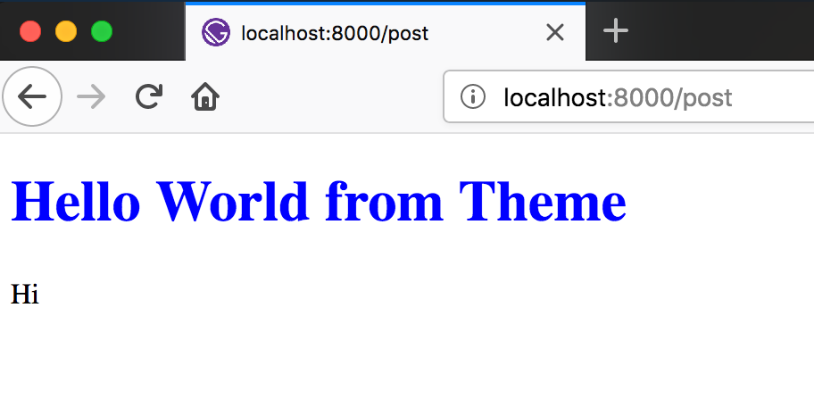
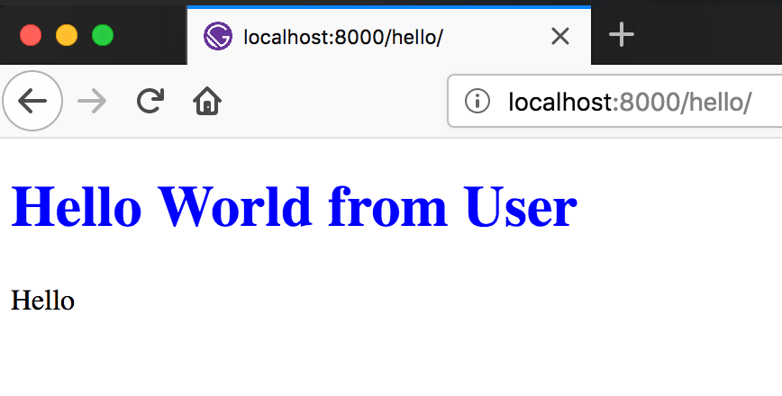
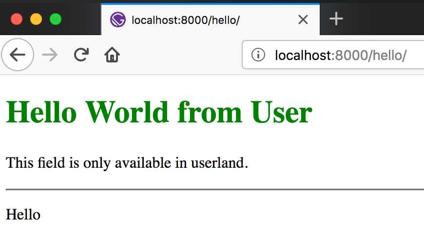

Gatsby has been gaining so much traction for the past few months. When I was first introduced to Gatsby, there was only 3 official starters as well as a handful of others. Nowaday, we have a showcase of starters with many different combination of CMSs and UI libraries integration. Things are great and dandy, yet I still feel like something is missing. Having built several sites in Gatsby, I find myself installing the same packages, setting up page creation, or adding some configuration again and again. It's repetitive and tedious. There are rooms for improvement.

Recently, [Chris Biscardi](https://twitter.com/chrisbiscardi) from the Gatsby team introduced [Gatsby Theme](https://www.gatsbyjs.org/blog/2018-11-11-introducing-gatsby-themes/#why-themes), allowing users to reuse the same configuration across multiple sites. This definitely is a game changer for many people. It allows the already-exciting ecosystem of Gatsby starters to become even more reusable. It can also let newcomers to utilize Gatsby without much traction.

Super excited about the new feature, I've been playinng around with it for some time. Here is how you can get started with Gatsby Theme:

**NOTE**: _Theme is an experimental feature. You may want to consider that before using it for any serious project._

## What we're gonna build

We're going to set up a simple blog with Gatsby using markdown files. We can then make it into a theme. You will see how easy it will be for theme-user to leverage theme's functionality to create websites.

We'll also poke around some current patterns that theme developers can use to allow further customization from users.

## Set up the blog

I'll speed through the initial set up of the blog as I assume you are already familiar with Gatsby.

First, we'll use yarn workspaces to set this up. Using yarn workspaces is not mandatory, but it helps when we want to consume the theme locally without publishing it to npm. Let's create a new directory and set up our workspace:

```sh
mkdir gatsby-theme-tutorial
cd gatsby-theme-tutorial

# This will be our workspace root
```

```json
// in package.json
{
  "name": "gatsby-theme-tutorial",
  "version": "1.0.0",
  "license": "MIT",
  "private": true,
  "workspaces": ["packages/*"]
}
```

**NOTE**: _The `private` field is required for yarn workspaces to work._

We'll start from `gatsby-starter-hello-world`.

```sh
mkdir packages
gatsby new packages/gatsby-theme-tutorial https://github.com/gatsbyjs/gatsby-starter-hello-world
```

We'll go into the `package.json` of our theme and name it `gatsby-theme-tutorial`. We need to do this so that yarn knows about our theme.

```json
// in packages/gatsby-theme-tutorial/package.json

{
  "name": "gatsby-theme-tutorial", // highlight-line
  "...": "..."
}
```

Let's create the blog post:

```md
<!-- in packages/gatsby-theme-tutorial/src/pages/post.md -->

---

title: "Hello World from Theme"
slug: "post"

---

Hi
```

Add some necessary packages to transform it into Gatsby data:

**NOTE**: _Also, make sure you're running at least Gatsby version 2.0.57._

```sh
# in packages/gatsby-theme-tutorial/
# let's also upgrade to the latest gatsby version at this time
yarn add gatsby@^2.0.57 gatsby-source-filesystem gatsby-transformer-remark
```

```js
// in packages/gatsby-theme-tutorial/gatsby-config.js

module.exports = {
  plugins: [
    {
      resolve: "gatsby-source-filesystem",
      options: {
        path: "src/pages",
        name: "pages",
      },
    },
    "gatsby-transformer-remark",
  ],
}
```

Now let's turn markdown files into a page on our blog:

```js
// in packages/gatsby-theme-tutorial/gatsby-node.js

const path = require("path")

exports.createPages = ({ graphql, actions }) => {
  const { createPage } = actions

  return new Promise(resolve => {
    resolve(
      graphql(
        `
          {
            posts: allMarkdownRemark {
              edges {
                node {
                  frontmatter {
                    slug
                  }
                }
              }
            }
          }
        `,
      ).then(({ data: { posts } }) => {
        posts.edges.map(({ node: { frontmatter: { slug } } }) => {
          createPage({
            path: slug,
            component: path.resolve(__dirname, "src/templates/PostTemplate.js"),
            context: { slug },
          })
        })
      }),
    )
  })
}
```

```jsx
// in packages/gatsby-theme-tutorial/src/templates/PostTemplate.js

import React from "react"
import { graphql } from "gatsby"
import Title from "../components/Title"

function PostTemplate({ data: { post } }) {
  return (
    <div>
      <Title>{post.frontmatter.title}</Title>
      <div dangerouslySetInnerHTML={{ __html: post.html }} />
    </div>
  )
}

export default PostTemplate

export const pageQuery = graphql`
  query($slug: String!) {
    post: markdownRemark(frontmatter: { slug: { eq: $slug } }) {
      html
      frontmatter {
        title
      }
    }
  }
`
```

```jsx
// in packages/gatsby-theme-tutorial/src/components/Title.js

import React from "react"

function Title({ children }) {
  return <h1 style={{ color: "blue" }}>{children}</h1>
}

export default Title
```

That should be it for the blog. Let's try and see if it's working:

```sh
# in workspace root
yarn install
yarn workspace gatsby-theme-tutorial start
```

If you can navigate to [localhost:8000/post](localhost:8000/post) and see this, everything is going well so far. 🎉



## Make it a theme

## Use it

Let's create another Gatsby site and consume the theme we just create. And yes, that's right. We didn't have to do anything special. At its core, a theme is just a regular Gatsby site.

```sh
# in workspace root

# since theme is just a Gatsby plugin, for it to work,
# we have to create an empty file called index.js
touch packages/gatsby-theme-tutorial/index.js

gatsby new packages/blog https://github.com/gatsbyjs/gatsby-starter-hello-world

yarn workspace blog add gatsby-theme-tutorial@1.0.0
```

And create a blog post:

```md
<!-- in packages/gatsby-theme-tutorial/src/pages/hello.md -->

---

title: "Hello World from User"
slug: "hello"

---

Hello
```

Let's try and run it:

```sh
yarn workspace blog start
```

And voila:



It's that easy!! Using themes, users can just focus on their content and don't have to worry about the code.

## Customization

### 1. Component Shadowing

As great as any theme can be, there will always be something that we want to change.

In this case, we're using an awesome theme already, but let's say we don't like the color of the title. This blue is not very good, and we want something better.

We can totally do this with ease with Component Shadowing. It's an awesome feature where we can create a component in our blog, and it'll override the corresponding component in the theme. All we need to do is creating a folder with the theme name (`gatsby-theme-tutorial`) under our `components` folder and putting the new-and-improved component there.

Let's recreate the title component there:

```jsx
// in packages/blog/src/components/gatsby-theme-tutorial/Title.js
// let's change the color from blue -> green

import React from "react"

function Title({ children }) {
  return <h1 style={{ color: "green" }}>{children}</h1>
}

export default Title
```

Save, and see the magic happens. Yes. It's that easy.

### 2. Query - Render separation

With component shadowing, there arises an interesting pattern for theme developers to allow full UI customization by the users.

In our templates, instead of querying the data AND rendering some UI/layout, we can just query the data and let a component takes care of the rendering. Let's try it:

```jsx
// in packages/gatsby-theme-tutorial/src/templates/PostTemplate.js

import React from "react"
import { graphql } from "gatsby"
import PostTemplateRenderer from "../components/PostTemplateRenderer"

export default props => <PostTemplateRenderer {...props} />

export const pageQuery = graphql`
  query($slug: String!) {
    post: markdownRemark(frontmatter: { slug: { eq: $slug } }) {
      html
      frontmatter {
        title
      }
    }
  }
`
```

```jsx
// in packages/gatsby-theme-tutorial/src/components/PostTemplateRenderer.js

import React from "react"
import Title from "./Title"

function PostTemplateRenderer({ data: { post } }) {
  return (
    <div>
      <Title>{post.frontmatter.title}</Title>
      <div dangerouslySetInnerHTML={{ __html: post.html }} />
    </div>
  )
}

export default PostTemplateRenderer
```

Now, if the user wants to change the template, with component shadowing, they can do so by creating the renderer component:

```jsx
// in packages/blog/src/components/gatsby-theme-tutorial/PostTemplateRenderer.js

import React from "react"
import Title from "./Title"

function PostTemplateRenderer({ data: { post } }) {
  return (
    <div>
      <Title>{post.frontmatter.title}</Title>
      <hr /> {/* highlight-line */}
      <div dangerouslySetInnerHTML={{ __html: post.html }} />
    </div>
  )
}

export default PostTemplateRenderer
```

You should see a line separating the title and content.

**NOTE**: _If it's not working for you, try stopping the running Gatsby process and restart it. New component shadowing will require you to rerun the site. This is a bug/limitation of Gatsby theme right now as it's still in an experimental state._

This is such a powerful pattern which allows users full customization of their website. If you're thinking about building a Gatsby theme, I'd highly recommend you consider this pattern.

### 3. Override Gatsby template

Now, let's say we want to make a change in our data structure. We'd like our blog post to have a `description` field. We can totally do that with Gatsby theme, but we'd have to override the template. This is a big task as we're essentially creating a _child theme_ with some extra functionality. But don't worry, we can totally achieve this. Let's do it together:

We'd have to use a Gatsby lifecycle, `onCreatePage`. You can learn more about that method and others in the [Gatsby docs](https://www.gatsbyjs.org/docs/node-apis/). For now, here's what we're gonna do:

1. Create a replacement template
2. Point the old pages to use our new template in `gatsby-node.js` using `onCreatePage`

So, here's how the updated template component looks with a new graphql query:

```jsx
// in packages/blog/src/templates/PostTemplate.js

import React from "react"
import { graphql } from "gatsby"
import PostTemplateRenderer from "../components/gatsby-theme-tutorial/PostTemplateRenderer" // highlight-line

export default props => <PostTemplateRenderer {...props} />

export const pageQuery = graphql`
  query($slug: String!) {
    post: markdownRemark(frontmatter: { slug: { eq: $slug } }) {
      html
      frontmatter {
        title
        description # highlight-line
      }
    }
  }
`
```

Now, nicely ask Gatsby to use our new template component whenever it creates a new post page:

```js
// in packages/blog/gatsby-node.js

const path = require("path")

exports.onCreatePage = ({ page, actions }) => {
  const { createPage, deletePage } = actions

  return new Promise(resolve => {
    // Check if this page is a post page created by theme "gatsby-theme-tutorial"
    if (
      page.component.includes("gatsby-theme-tutorial") &&
      page.component.includes("PostTemplate")
    ) {
      deletePage(page)
      createPage({
        ...page,
        component: path.resolve(__dirname, "src/templates/PostTemplate.js"), // Replacement template
      })
    }

    resolve()
  })
}
```

Don't forget to add the `description` field in our post:

```md
<!-- in packages/gatsby-theme-tutorial/src/pages/hello.md -->

---

title: "Hello World from User"
slug: "hello"
description: "This field is only available in userland." <!-- add description field -->

---

<!-- ... -->
```

And make use of that description in our renderer:

```jsx
// in packages/blog/src/components/gatsby-theme-tutorial/PostTemplateRenderer.js

// ...

function PostTemplateRenderer({ data: { post } }) {
  return (
    <div>
      <Title>{post.frontmatter.title}</Title>
      <p>{post.frontmatter.description}</p> {/* highlight-line */}
      <hr />
      <div dangerouslySetInnerHTML={{ __html: post.html }} />
    </div>
  )
}

// ...
```

This should do the trick. Try running the blog, and you should see:



And there you have it, a fully customizable theme. Using theme makes it super easy to get started and utilize all the functionality of the theme. At the same time, users are still in control of their website and have the ability to change and customize it as they see fit.

## Publish

Before publishing the theme to NPM, there is one last step we have to do. As we're not compiling the code of the theme when publishing, we have to instruct Gatsby to utilize the build process of users' site. Without doinng so, there may be errors when we utilize language features like JSX.

```js
// in packages/gatsby-theme-tutorial/gatsby-node.js

// ...

// Let Webpack know how to process files
exports.onCreateWebpackConfig = ({ stage, loaders, actions }) => {
  actions.setWebpackConfig({
    module: {
      rules: [
        {
          test: /\.js$/,
          include: path.dirname(require.resolve("gatsby-theme-tutorial")),
          use: [loaders.js()],
        },
      ],
    },
  })
}
```

That's it. Your theme is now ready to be published and reused. If you'd like to play around more with themes, you can find the code for this tutorial at [this repo](https://github.com/alexluong/gatsby-theme-tutorial) or check out [themes examples](https://github.com/ChristopherBiscardi/gatsby-theme-examples) from the Gatsby team..

## Final thoughts

I'm super excited about the direction that Gatsby is going towards. After testing out Gatsby theme, I can see that it allows the theme developer full control of what to exposed to the users. But above all, it gives developers the ability to reuse functionality and configuration quickly without boilerplates.

Gatsby theme helps developers create blazing fast websites blazingly fast.
