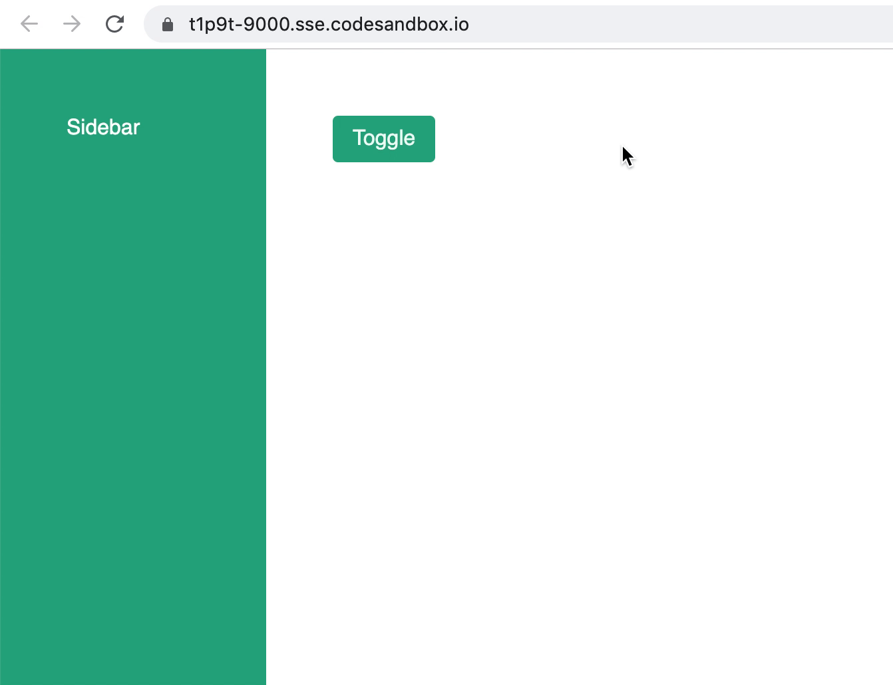

There are several ways you can start a React application, but which to choose? In this article, I hope to explain the pros and cons of each of these tools. Most importantly, you will gain a better understanding of server-side rendering. Let's get started.

## Client-side rendering

When writing React, the most basic paradigm is client-side rendering. Create React App (CRA) is one example using it. This is a basic HTML file of a React site:

```html:title=index.html
<!DOCTYPE html>
<html>
<body>
  <div id="root"></div>
</body>
</html>
```

When the browser fetches a React site, this is the first thing it receives. Once all the JavaScript has loaded, React will do its magic to manipulate the DOM and render your website inside the `root` element.

A client-rendered React site is a static site. For example, in Create React App, once you run `react-scripts build`, it will build your entire site in a `public` folder. You can then put that folder in a CDN, and your site is ready to go.

### Pros

Without discussing server-side rendering, it is difficult to explain the advantages of this approach. In short, it helps development straightforward and simple.

Another pro is that as it is a static site, the deployment process is easier as it does not involve a server.

### Cons

First of all, because React depends on JavaScript, users need to load JS before they can view the website and interact with it. This negatively affects load time, and in some situation makes your website unusable for people who disable JS on their browser.

But most importantly, this is not good for SEO. Although [Google claimed](https://webmasters.googleblog.com/2014/05/understanding-web-pages-better.html) that they can crawl and index JavaScript, this is still a controversial topic. Many believe that they have experienced serious SEO impact when switching from a server rendered site (think WordPress) to a client-side rendering React site.

Therefore, client-side rendering React is not a good choice for sites where SEO is important. Some examples of such site are landing pages, blogs, or forums. Content-focused sites, in general.

## Server-side rendering (SSR)

Here comes server-side rendering. This is Gatsby and Next camp. Here are what happens when you visit a server-rendered React site:

1. Browser fetches the site HTML with full content, not just a root element.
2. After rendering the HTML, the site will "turn into" a React app. The technical term for this process is `rehydration`.

In short, server-side rendering React means that it goes from React code —> HTML —> back to React. The aim is to serve the browser HTML, an answer to client-side rendering's cons.

### Pros

As SSR is the solution to solve shortcomings on client-side rendering, the pros are the direct opposite of CSR cons:

- Better load time + accessible to people who disable JS
- Better SEO (most important)

Moreover, in some technologies, you can utilize SSR to deliver the best user experience that is impossible with client-side technologies. I will give a demo about this later in this article.

### Cons

Sometimes, it's tricky to work with SSR. Because it tries to build HTML from React code in the server environment, browser APIs are not available. Therefore, you have to be careful when using `window` or `localStorage` in this situation.

## Gatsby vs Next

In the last section, I have a list of steps that happens when the you visit a server-rendered React site. There is actually step 0 that is missing: How to turn React code to HTML and serve it to the browser.

This is where Gatsby and Next differ in its approach.

Here is Gatsby's philosophy:

- During the build process, Gatsby will generate HTML pages from your React code. You deploy the built Gatsby site as a static site.

And here is Next's:

- During the build process, if there are any pages that do not require the server, Next will build them into HTML pages. When the browser fetches these pages, it will receive the static HTML.
- For pages that need a server, Next will build those into serverless functions/routes in an Express server. When the browser fetches these pages, it will send a request to the server, which then generates the needed HTML.

Gatsby's pattern is an interesting take on SSR as it's different from other SSR technologies like WordPress, PHP sites, Ruby on Rails, etc. Gatsby is originally a static site generator, a technology that produces a static website. Because it also utilizes the power or React, users can build dynamic web application on top of it.

[Ben Awad](https://twitter.com/benawad97) refers to Gatsby as [client-side rendering with prerendering](https://twitter.com/benawad97/status/1195398838758072320). My friend [Tejas Kumar](https://twitter.com/tejaskumar_) calls it "static server-side rendering" in contrast to "dynamic server-side rendering" in Next.

https://twitter.com/benawad97/status/1195398838758072320

## Which to choose

We've gone through the technical rundown of client-side rendering and server-side rendering as well as Gatsby vs Next, but what does that mean?

**Which tool should I choose for my next React project?**

*(next, lowercase, no pun intended)*

Let's discuss a few scenarios and discuss the right tool for the job:

### 1. Application behind an authentication gateway

If you're building a web app that is only accessible after user sign in, SEO should not be a factor. In this scenario, Create React App or other client-render technologies is the easiest solution for you. It let you develop without worrying about different environment (browser vs server), which can simplify things in many situations.

You can also use Gatsby. Although there can be an increase in difficulties, Gatsby does provide a lot of optimization out of the box for you. Among many things, some examples are code splitting, lazy loading, and link prefetching. The plugin ecosystem also helps setting things up, letting you focus on the business logic.

Lastly, Next should also work in this use case. In my opinion, it can be the most difficult. But because it is dynamic SSR, you can optimize the best user experience for users. Again, I will demonstrate this in the demo section later.

### 2. A content-focused site with static data

Sites like landing pages or blogs, where SEO is very important.

Because SEO is important, we can safely eliminate all client-side technologies. It's now the battle between Gatsby and Next.

I would like to split this further into 2 smaller situations.

The first situation is that you have all the data locally. For example: a landing page, blog posts written in markdown stored in the same repo, etc. With this, both Gatsby and Next are great solutions.

The other situation is when you have data from external sources like a content management system. In this use case, Gatsby is a better solution. It has a great data layer that let you focus on building the site instead of putting the data pipeline together. It then produces a static site, which is fast and scalable.

For example, let's say you're building a blog that get data from a headless WordPress. If you use Gatsby, there is some plugin setup that allow you to build the Gatsby site with all your blog. And when a new blog is added, it can trigger a webhook action that rebuild the site and redeploy it.

If you use Next for this project instead, you have 2 options:

- Create a dynamic route that will fetch the blog post data on every render. Every time a user visits an article page, Next will send a request to WordPress to get the post and render it. This process makes your site slower and less scalable compared to Gatsby.
- Fetch all blog posts at build time and generate static pages. With this option, you're trying to replicate the process that Gatsby is already doing for you. This is essentially reinventing the wheel, which is not necessary.

Therefore, I think Gatsby has the edge in this use case.

### 3. A content-focused site with dynamic data

Again, as SEO is important, we can eliminate all client-side technologies. Sorry CRA.

A perfect example of this type is a forum. [Spectrum Chat](https://spectrum.chat/) is a good practical example.

In a forum, we want Google to index all pages. The content of every page is dynamic as you need to query your database to fetch the necessary content.

As far as I know, it's quite impossible to handle this use case with Gatsby. Next is the way to go.

### TLDR:

- If you don't need SEO: CRA should work. You can use Gatsby and Next too, but they can be more difficult to develop.
- If you do need SEO: Gatsby for static content, Next for dynamic.

## UX/DX, with demos

SEO aside, let's discuss server-side rendering's impact on user experience (UX) and developer experience (DX).

I'm going to build a persisted sidebar to demonstrate this concept. The sidebar will have 2 states, open or close. On refresh, the site should render the sidebar in its correct state.

Let's build it in Create React App:

```jsx:title=CreateReactApp
import React from "react";
import ReactDOM from "react-dom";
import { animated } from "react-spring";
import { useAnimation } from "./useAnimation";
import "./styles.css";

// we're saving the sidebar state in local storage
// this is the local storage item name
const LOCAL_STORAGE_KEY = "isSidebarOpen";

// React hook that handles sidebar state
function useSidebar() {
  const persistedState = localStorage.getItem(LOCAL_STORAGE_KEY) === "true";

  const [isOpen, setIsOpen] = React.useState(persistedState);
  const toggle = () => setIsOpen(value => !value);

  // Persist to localStorage
  React.useEffect(() => {
    localStorage.setItem(LOCAL_STORAGE_KEY, JSON.stringify(isOpen));
  }, [isOpen]);

  return { isOpen, toggle };
}

function App() {
  const { isOpen, toggle } = useSidebar();
  const styles = useAnimation(isOpen);

  return (
    <div className="app">
      <animated.div className="sidebar" style={styles.sidebar}>
        Sidebar
      </animated.div>
      <animated.div className="main" style={styles.main}>
        <button className="btn" onClick={toggle}>
          Toggle
        </button>
      </animated.div>
    </div>
  );
}

const rootElement = document.getElementById("root");
ReactDOM.render(<App />, rootElement);
```

Here is a CodeSandbox you can play around with. Toggle it a couple times. Refresh the page. Go wild!

https://codesandbox.io/s/sidebar-cra-hv0rc?fontsize=12&hidenavigation=1

When porting this to Gatsby, we need to make sure `window` is available:

```jsx:title=Gatsby {5-8}
...

function useSidebar() {
  // if window type is undefined --> server side
  const persistedState =
    typeof window === "undefined"
      ? false
      : localStorage.getItem(LOCAL_STORAGE_KEY) === "true";

  const [isOpen, setIsOpen] = React.useState(persistedState);
  const toggle = () => setIsOpen(value => !value);

  React.useEffect(() => {
    localStorage.setItem(LOCAL_STORAGE_KEY, JSON.stringify(isOpen));
  }, [isOpen]);

  return { isOpen, toggle };
}

...
```

With this code, the Gatsby site is working. But only in development mode. In production, it's sadly not working as expected.


When the sidebar is opened and you refresh the page, you can see that it's closed instead. Then, when you click the toggle button, the sidebar will close instead of open.

If you want to see and explore for yourself, here is the [CodeSandbox](https://codesandbox.io/s/sidebar-gatsby-error-seg2c). I don't embed it inside this article because the error only happens in production and you don't have access to the terminal to run the commands in the embed. When you're in CodeSandbox, please open a new tab in the terminal and run this command:

```bash
yarn build && yarn serve
```

Once Gatsby finishes the build, CodeSandbox will prompt you to open the new port in the browser.

What is happening is that during the build step, `persistedState` is `false`. Once the site rehydrates to React app, `persistedState` will then turn into `true`. However, since we're not updating state or anything, React does not rerender. Therefore, the sidebar remains closed. When you click the toggle button, it toggles the state from `true` to `false`, hence the sidebar closes.

To fix this, we need to add a set the state during the rehydration phase (`componentDidMount`). Here is the working version:

```jsx:title=WorkingGatsby {10,17-20}
...

function useSidebar() {
  const persistedState =
    typeof window === "undefined"
      ? false
      : localStorage.getItem(LOCAL_STORAGE_KEY) === "true";

  // we choose a sensible initial state for the sidebar
  const [isOpen, setIsOpen] = React.useState(false);
  const toggle = () => setIsOpen(value => !value);

  React.useEffect(() => {
    localStorage.setItem(LOCAL_STORAGE_KEY, JSON.stringify(isOpen));
  }, [isOpen]);

  // rehydrate with persisted data
  React.useEffect(() => {
    setIsOpen(persistedState);
  }, []);

  return { isOpen, toggle };
}

...
```

I choose to set the initial sidebar state to be closed. When the browser renders the page and the sidebar is open, you can see that the sidebar animates out. If the initial state is opened, when the sidebar is closed and you refresh the page, it will animate in. Between the two experiences, I think the former is more natural.

Here is how it's behaving, and the [CodeSandbox](https://codesandbox.io/s/sidebar-gatsby-working-t1p9t) for you to play around with as well. Don't forget to run it in production.



The same code here would also [work in Next](https://codesandbox.io/s/sidebar-next-working-2w679). Let me further clarify that the problem that we have encountered was not a Gatsby issue. It's an [SSR issue that Next also endures](https://codesandbox.io/s/sidebar-next-error-60smd).

However, I think we can take this sidebar one step further. Right now, when the site renders with an opened sidebar, the sidebar will animate out. I think it would be better if the sidebar is just opened without any animation. This is the behavior we initially have when using Create React App. Is there any way we can replicate that with Gatsby and Next?

For Gatsby, the answer is no. As far as I know, it's impossible to achieve that experience. Because the HTML is built at build time, there is no way we can get any information about the state of the sidebar. Hopefully with the introduction of Suspense, there can be some way to deliver a better user experience in the future.

On the other hand, we can totally deliver this experience with Next. What we need to do is to save the sidebar state in a cookie instead of local storage. As the cookie will be sent to the server side, we can generate the correct HTML without needing to update the UI after rehydration. Here is how you can do that:

```jsx:title=NextJS {3,17,23,24,45-50}
import React from "react";
import { animated } from "react-spring";
import { parseCookies, setCookie } from "nookies";
import { useAnimation } from "../useAnimation";
import "../styles.css";

const COOKIE_KEY = "isSidebarOpen";

// the useSidebar hook accept the initial sidebar state as argument
// this value is taken from the cookie in the server side
function useSidebar(initialIsOpen) {
  const [isOpen, setIsOpen] = React.useState(initialIsOpen);
  const toggle = () => setIsOpen(value => !value);

  // save data to cookies
  React.useEffect(() => {
    setCookie({}, COOKIE_KEY, JSON.stringify(isOpen), {});
  }, [isOpen]);

  return { isOpen, toggle };
}

function IndexPage({ isSidebarOpen }) {
  const { isOpen, toggle } = useSidebar(isSidebarOpen);
  const styles = useAnimation(isOpen);

  return (
    <div className="app">
      <animated.div className="sidebar" style={styles.sidebar}>
        Sidebar
      </animated.div>
      <animated.div className="main" style={styles.main}>
        <button className="btn" onClick={toggle}>
          Toggle
        </button>
      </animated.div>
    </div>
  );
}

// - this function is run on the server
// - it also tells Next that this page is a dynamic page
// - what this function is doing is getting the sidebar state
// from the cookie and send it to React component to render the correct HTML
IndexPage.getInitialProps = async ctx => {
  const cookies = parseCookies(ctx);
  const sidebarState = cookies[COOKIE_KEY];
  const isSidebarOpen = sidebarState ? sidebarState === "true" : true;
  return { isSidebarOpen };
};

export default IndexPage;
```

And of course, a CodeSandbox for you here.

https://codesandbox.io/s/sidebar-next-best-mtb2z?fontsize=12&hidenavigation=1

Hopefully, through this example you can see how SSR affects different technologies and the advantage of dynamic SSR. It also demonstrates how using client-side rendering can make things much more straightforward.

Here are the lists of all available CodeSandboxes that you can explore:

- [Create React App](https://codesandbox.io/s/sidebar-cra-hv0rc)
- [Gatsby - issue](https://codesandbox.io/s/sidebar-gatsby-error-seg2c)
- [Gatsby - working](https://codesandbox.io/s/sidebar-gatsby-working-t1p9t)
- [Next - issue](https://codesandbox.io/s/sidebar-next-error-60smd)
- [Next - working](https://codesandbox.io/s/sidebar-next-working-2w679)
- [Next - best experience](https://codesandbox.io/s/sidebar-next-best-mtb2z)

## Summary

To recap:

- If SEO is **important**:
  + CRA is out, sorry
  + Gatsby if your SEO content is static
  + Next if your SEO content is dynamic
- If SEO is **NOT important**:
  + CRA is the easiest
  + Gatsby has nice built-ins
  + NextJS gives you full control

Hopefully this article has been helpful to you. Please feel free to reach out if you have any questions or feedback.
