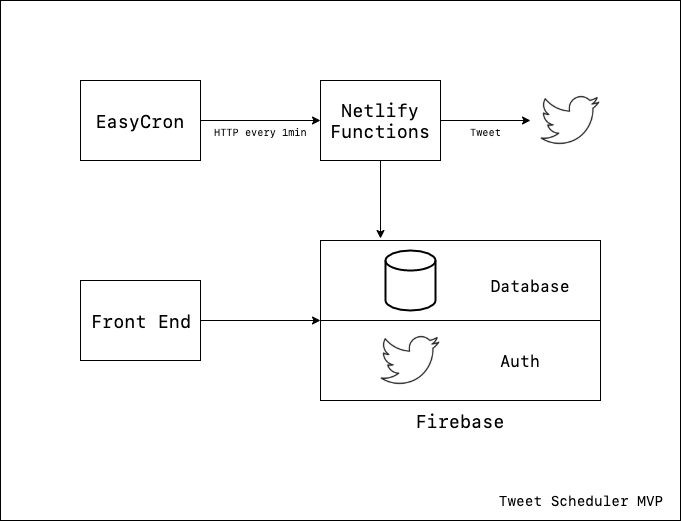
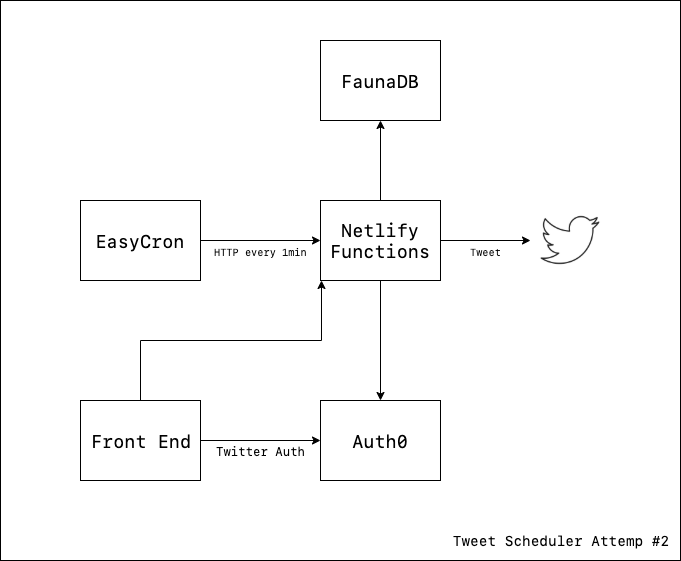
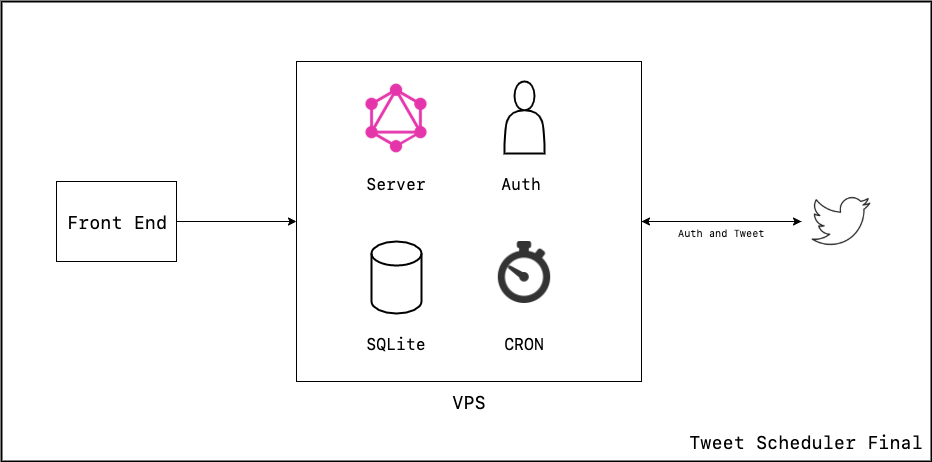

I recently "launched" [Tweet Scheduler](https://tweetscheduler.app), my first finished side project. I got a chance to play with new technologies and enjoyed working on it. Here is a reflection on what I learned and my decision making process.

## Requirements

Here is how the app works:

- User can write the tweets and choose when they will be posted
- At said time, the tweets will be posted

Simple enough.

On a technical perspective, here are what's needed:

- The UI for users to schedule the tweets
- The database to save these data
- A CRON job that runs every minute, checking if there are any tweet to be posted
- A server to post tweets

## Minimal Viable Product

In the MVP, I chose technologies optimized for speed. For that, Firebase was my top choice because at its core, it's Database as a Service along with other features, including easy Twitter authentication. That, my friend, is a front end developer dream, especially for rapid prototype.

To put everything together with Firebase, here is the application architecture:

A brief explanation of the architecture:

- Users use the front end to write scheduled tweets.
- These tweets are saved to Firebase.
- Every minute, EasyCron, a CRON service, sends a request to a Netlify function.
- That function checks if any there are any tweets to be posted and post them to Twitter.

Using this architecture, I was able to build the first version of Tweet Scheduler in a day or two. The MVP was functional but has a big issue: **Security**.

Because I'm posting the tweet for users, I have to save their access token and secret in the database. In my Netlify function, I will then fetch those tokens and send the request. However, there is currently some issues using Netlify function and `firebase-admin`, so the authentication is more complicated that I desire. Coupled that with some minor Firebase issue on the front end and my wish to try out other technologies, I decide to *rip* out the Firebase layer and try out something else.

## Replace Firebase

Without Firebase, I needed to come up with solutions for database and authentication. I decided to try out some technologies that I've known for a while but hadn't had a chance to use yet: [FaunaDB](https://fauna.com) and [Auth0](https://auth0.com).

Of the two, I'm particularly excited about FaunaDB. Besides Dynamo, Aurora, and Cosmos provided by AWS and Azure, Fauna seems to be the only other serverless database option. It's supposed to work great with Netlify functions because of the [serverless architecture]([https://serverless.com/blog/choosing-a-database-with-serverless](https://serverless.com/blog/choosing-a-database-with-serverless/)).

Here is how the updated architecture would look like:

This change in architecture put a lot of weight and complexity on the Netlify functions layer. Before, it was just 1 function that runs every minute. With this change, it would become the server layer that takes request from the front end and talks to the database.

Excited as I were, I did not find much success after a few hours trying out these technologies. Here comes the recap of my experiences, but please note that this is just my opinion based on my own personal bias and preference only. You may have different opinions, and I highly recommend that you try them out yourself.

The main problem I ran into with Fauna is Fauna Query Language (FQL). I have some experiences with SQL and MongoDB, and FQL is certainly a new concept to me. After a few hours, I was still not productive and ran into some issues with their querying syntax. As Fauna is not as popular as other databases, I could not find many good educational resources on it.

With that said, a few days after I finished Tweet Scheduler, [Chris Biscardi]([https://twitter.com/chrisbiscardi](https://twitter.com/chrisbiscardi)) dropped [a collection of FaunaDB lessons on Egghead]([https://egghead.io/playlists/the-complete-guide-to-faunadb-74bef44b](https://egghead.io/playlists/the-complete-guide-to-faunadb-74bef44b)). Had this existed 2 weeks earlier, I would probably have a much better experience.

As for Auth0, there is no specific flaws or shortcomings on their side. I'm using Gatsby to build the app, and there were some problems that came with server side rendering. I was able to resolve it, but the end result was not as streamlined as I'd like.

### VPS - Final Solution

In the end, I decided to roll out my own back end on a VPS. In doing so, I hoped to gained more experience using server and Linux. With that, I would also run my own CRON job from my server without relying on an external service.

Here is how it looks:

I know, not as exciting in todays' world where serverless is taking over everything. Maybe as I gain more experiences with traditional servers, I can finally appreciate what serverless can do, as I'm previously just kinda impressed with them but was never a fan.

Until then, I'm quite happy with this set up.

## Misc

Besides the overarching architecture of the app, I also made other smaller decisions over which technologies or libraries to use.

For the UI library, I used [Chakra UI](https://chakra-ui.com) and enjoyed it a lot. I really like its aesthetic. And as it uses [Styled System]([https://styled-system.com](https://styled-system.com/)), this was also my first exposure to the library, and it didn't disappoint. As of right now, this is by far my favorite way of writing "CSS".

For the front end GraphQL client, I decided to try out [Urql]([https://formidable.com/open-source/urql](https://formidable.com/open-source/urql/)) as I already have some experiences with [React Apollo]([https://www.apollographql.com/docs/react](https://www.apollographql.com/docs/react/)). Because Urql relies heavily on its cache, I gained a better understanding and appreciation to how different GraphQL client libraries handle cache. I'd definitely recommend anybody to try it out as I have a great time using it as well.

---

In the end, I'm happy with my decisions and the tech stack I chose for Tweet Scheduler. If there's one thing I would do differently, I would also 1. try out [Hasura]([https://hasura.io](https://hasura.io/)) and 2. maybe stick with FaunaDB a bit longer. But overall, the final architecture is going to be my tech stack of choice for my future projects.