## ⛔️ Don't: Be a bully

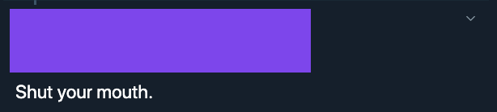

Don't do this. Bully bad 👎

## ✅ Do: Be supportive

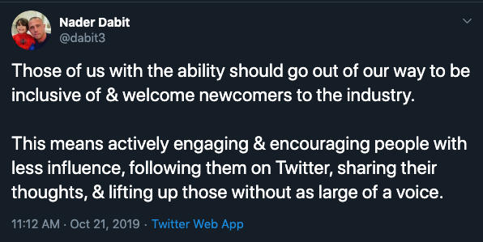

Do this. Inclusion good 👍

---

## ✅ Do: Spread love

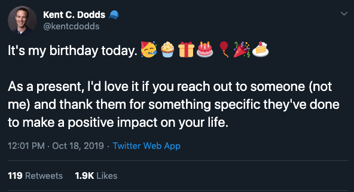

Nuff said.

## ⛔️ Don't: Spread hate

Okay I can't find a good example here, but don't do this, kids.

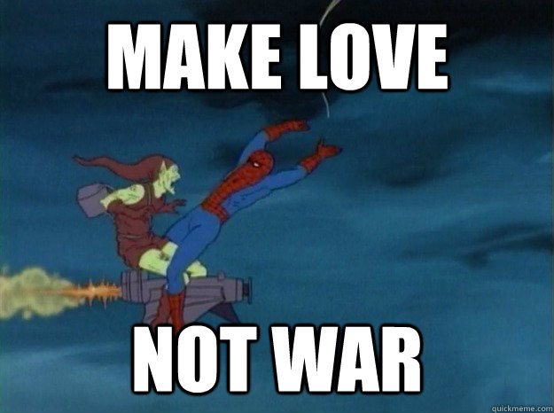

---

## ✅ Do: Be nice

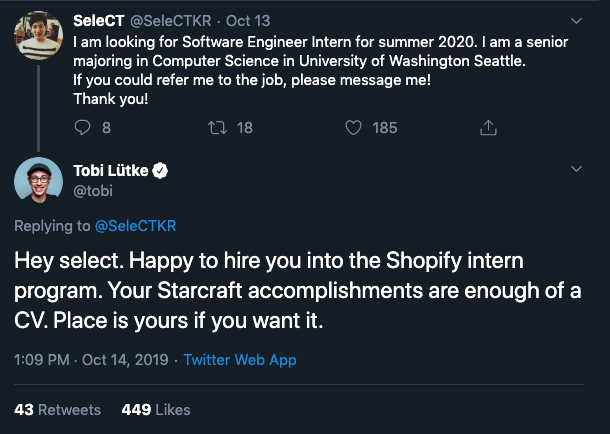

Okay this may be a bit off-topic, but isn't this interaction just so wholesome? Let's all offer each others jobs and skip the 100 rounds whiteboard interviews with 20 take home exercises. Oh and since we're on this topic, I'm also looking for a job so someone, offer me a job too!!!! Gimme gimme.

## ⛔️ Don't: Be mean

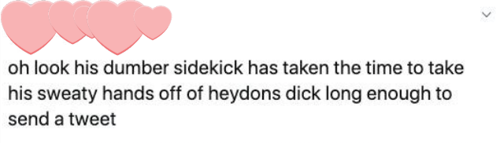

I'm totally taking this out of context here. But no matter what the context is, it's inadvisable to call people dumb. Or make inappropriate remarks towards others.

---

## ✅ Do: Ask for help

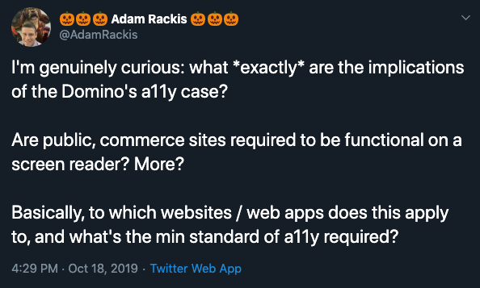

## ✅ Do: Offer help

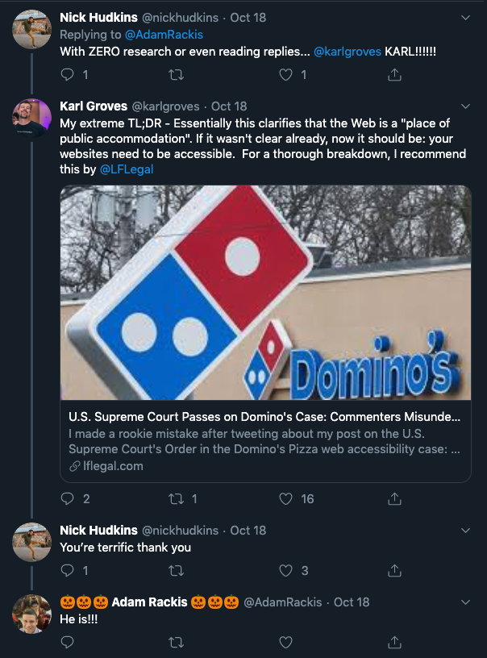

## ⛔️ Don't: Jump to conclusion

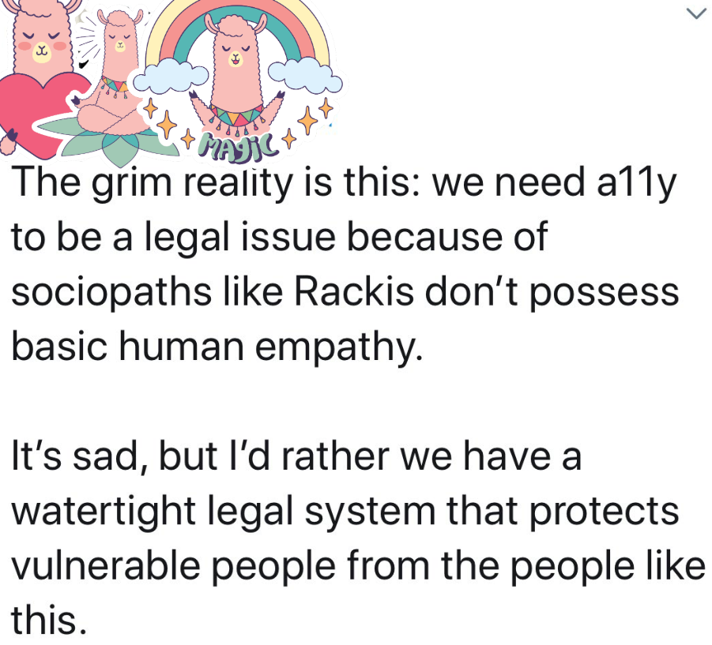

Please don't assume that everybody has bad intention. It may be hard to convey intent via text sometimes. Instead, how about asking clarifying questions to understand others thoughts before ... attack them.

## ✅ Do: Have a civil discussion

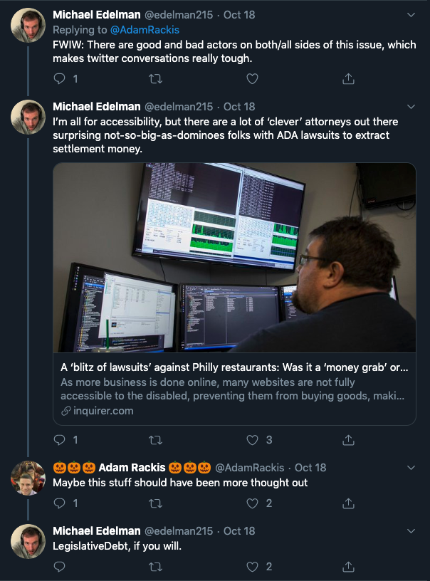

## ⛔️ Don't: Make personal attack

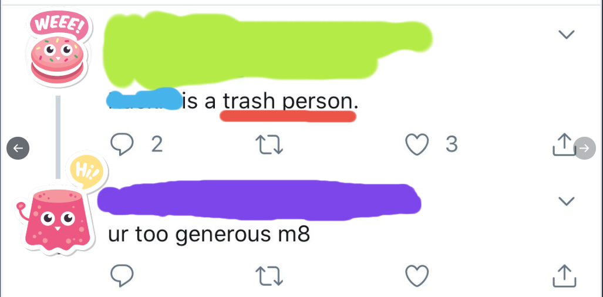

---

## ⛔️ Don't: Harass people in their DM

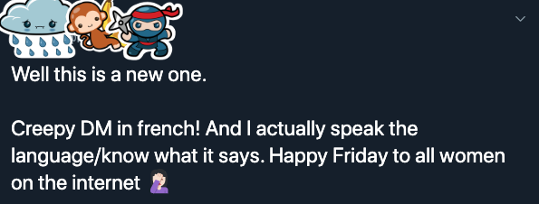

Don't do this guys and gals.

Shameless plug: I made a Twitter bot that filters out these sort of messages. Anybody having this issue please holler at me thank you very much 😇

## ✅ Do: Be nice in DM

If you're to send somebody a private message, at the very least have the decency to be nice.

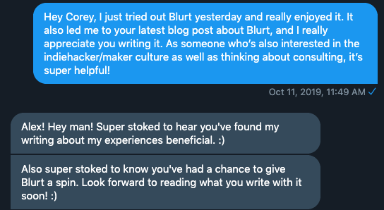

That's me 😇

Another me:

## ✅ Do: Be helpful

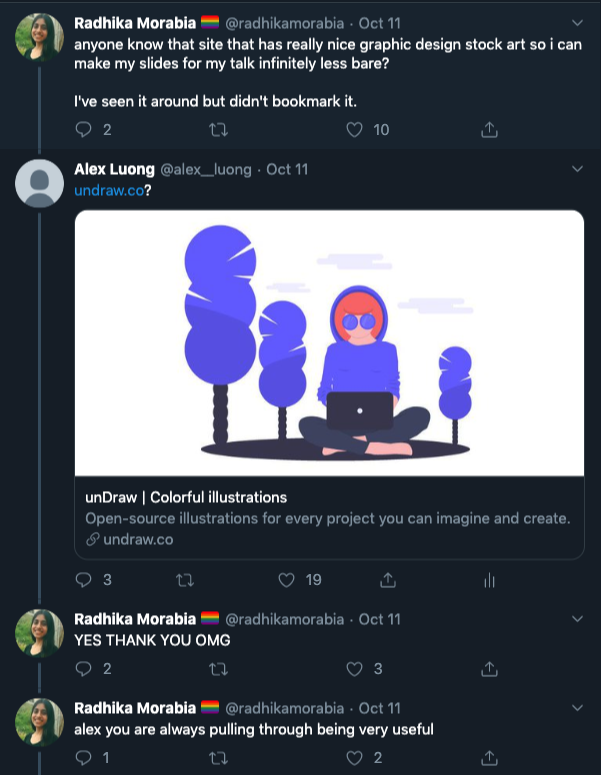

🤓🤓

---

Bonus:

## ✅ Do: Build bots

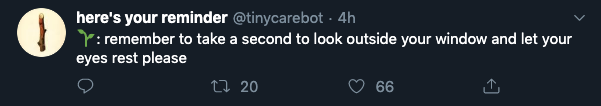

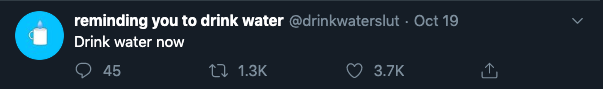

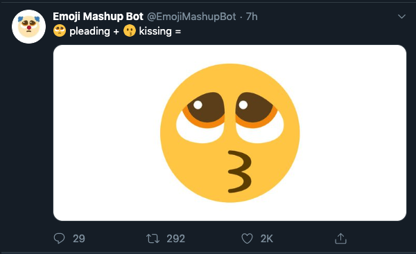

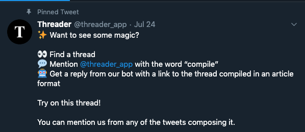

Let's build lots and lots of Twitter bots to enrich your and everyone else's experiences on this blue platform.

Another shameless plug: If you don't know how to build a Twitter bot, stay tuned for my comprehensive guide on how to create one. Coming later this week. I'm serious. Read my stuff. Please!!

---

## To sum up:

✅ Do: Be supportive

✅ Do: Spread love

✅ Do: Be nice

✅ Do: Ask for help

✅ Do: Offer help

✅ Do: Have a civil discussion

✅ Do: If you're to send somebody a private message, at the very least have the decency to be nice

✅ Do: Be helpful

✅ Do: Build bots

⛔️ Don't: Be a bully

⛔️ Don't: Spread hate

⛔️ Don't: Be mean

⛔️ Don't: Assume bad intentions

⛔️ Don't: Make personal attack

⛔️ Don't: Harass people in their DM

---

These are just a few examples of accepted and unaccepted behaviors on Twitter, in my **personal** opinion.

Everything boils down to **use common sense** and **treat others how you'd like to be treated**. Basic elementary stuff, I know, but not everybody is following.

At the end of the day, you do you. I'm not your mother. I can't tell you what to do. So...

Happy tweeting!

🎤👋 (mic drop)