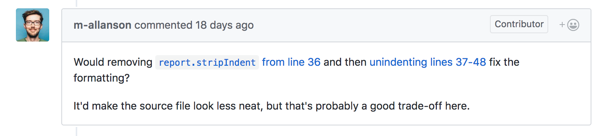
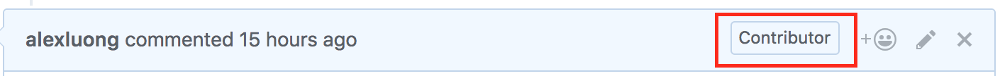

For the longest time, I was so intimidated by the idea of open-source. A lot of them are amazing projects that are engineered by the best developers with years of experience. How can someone without much experience like myself be able to help?

Well, I tried to do it anyway. And turned out it was not as scary as I thought. After tinkering around [GatsbyJS](https://github.com/gatsbyjs/gatsby "GatsbyJS Github repo"), I found an issue I could address. I attempted to solve and and made a [pull request](https://github.com/gatsbyjs/gatsby/pull/5545 "My very first pull request"). AND IT GOT ACCEPTED AND MERGED. So I made my first open-source contribution. It's a huge milestone in my development career.

In this post, I'll write down my experience in getting started with open-source, and hopefully it will encourage you to contribute too.

## My background and how I got interested in open-source

I'm not an experienced developer by any means. To give you some context, I'm a second-year Computer Science student. I first started to learn web development a year ago (March 2017, prior to that, I don't know what HTML is). I had about 6 months of React experience under my belt.

A while back I came across Gatsby as I was listening to an episode of Syntax. It was very fascinating to me, so I took [a course by Scott Stolinski](https://www.leveluptutorials.com/tutorials/pro-gatsby "Pro Gatsby by Level Up Tutorials") to learn about it. Lately, as I felt the itch to work on an open-source project, I decided to give Gatsby a try because of a couple reasons:

- It's an amazing project, and I have so much fun working with it.

- It's built with Node and React, the tech stack I'm most familiar with.

So this is how it all went down.

## The steps I took to make my first pull request

Here is the exact steps that I took to made my first contribution:

- I checked out the open issues currently in the repo. I put more attention to those with the labels `status: help wanted` and `good first issue`.

- I came across [this issue](https://github.com/gatsbyjs/gatsby/issues/5379 "The issue I solved"), which seemed to be pretty straight forward. Well, someone already pointed out how to solve it to the very line of code. How more can I ask for, right?

- So, I jumped on it. Forked. Cloned. Branched. Then I followed what he suggested. And voila, it works. Well not entirely, but I added one more line of code and it worked. Added. Committed. Pushed. Pull Request requested.

- And there I sat, patiently I waited, only checking on my pull request every 15min hopefully someone, anyone would give me a feedback on it.

- Well, the next day and a few comments later, my pull request is merged. It felt amazing. I am now a proud contributor of GatsbyJS.

## What I learned from my first contribution

So, here are a few things I took away from the experience:

- I don't have to be a rock star developer to contribute. As you can tell, all I did was follow what was suggested. That's a great start for me. Hopefully with time I can tackle more complex problems.

- Gatsby is great and quite beginner-friendly. I think the issue that I worked on could be done in 5min by any of Gatsby's maintainers, but they opened and kept it there anyway for beginners like me to contribute. I highly appreciate that and hope it's the same for every other open-source projects.

- It feels really really good to contribute. It just feels good. I don't know how to explain it. You gotta experience it to know, I guess. So go ahead and try to contribute. You'll know what I mean.

## Some useful resources

There are a few resources that are critical to my contribution:

- [This course](https://egghead.io/courses/how-to-contribute-to-an-open-source-project-on-github "How to contribute to an open source project on Github") on Egghead: How to Contribute to an Open Source Project on GitHub by [Kent C. Dodds](https://twitter.com/kentcdodds "Kent C. Dodds' twitter"). It's very useful for newbies like me to learn the workflow when working on open-source.

- [This blog post](https://medium.com/@ken_wheeler/a-bitter-guide-to-open-source-a8e3b6a3c1c4 "A bitter guide to open source") by [Ken Wheeler](https://twitter.com/ken_wheeler "Ken Wheeler's twitter") is both very informative and funny. Such an enjoyable read.

- [Scott Stolinski's Pro Gatsby course](https://www.leveluptutorials.com/tutorials/pro-gatsby "Pro Gatsby by Level Up Tutorial"). It was a cool course. Not only did I get a lot more comfortable with Gatsby, I also learned some sweet animation with Web Animation API.

And lastly, shoutout to Mike, the guy who literally spelled out how to fix the issue for me. Couldn't have done it without him. Big thanks!!

## That's it

So there it is. That's how I made my very very first open-source contribution. Now that I got a sweet taste of what it feels like, I look forward to being a more active member of the community.

As the matter of fact, I just made another pull request and patiently waited for feedbacks on it. It's literally 2 lines of code, but it took me a solid hour to figure it out.
